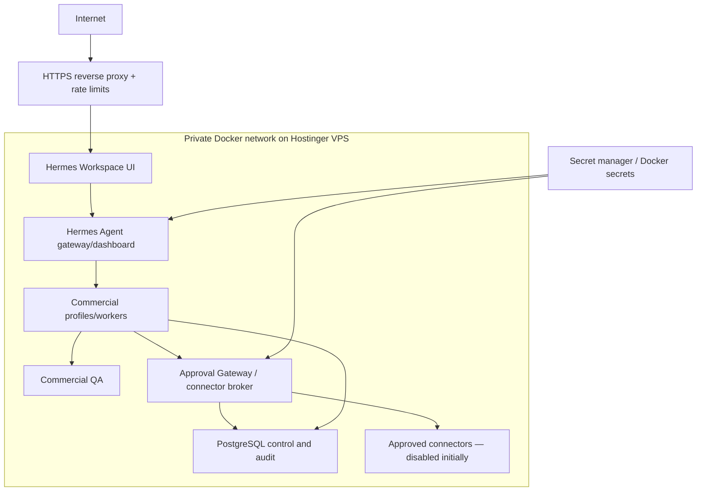

# Proposed Hostinger VPS Topology

Status: pending live VPS inspection.

## Hostinger requirements

- Linux VPS with Docker Engine and Compose plugin; exact OS/resources discovered at preflight.
- Immutable image tags/digests; do not deploy `latest`.
- Only ports 80/443 public. Workspace, gateway 8642, dashboard 9119, database and Approval Gateway remain private; firewall denies direct Internet access.
- HTTPS, secure cookies, strong Workspace auth, API server key, sanitized proxy headers and rate limits.
- Persistent encrypted/permissioned volumes for Hermes profiles, PostgreSQL and artifacts; encrypted off-host backup with restore test.
- Per-service Unix user/container capability minimization; no privileged containers or Docker socket inside agents.
- Secrets injected to service processes, never shared wholesale to profiles or stored in repo/.env/model memory.
- Egress allowlist for approved research/connectors; A3 connector broker disabled until stage 3.
- Time synchronization, log rotation, disk/cost alerts and resource limits.

The inspected repository includes a Hostinger Node.js entrypoint, but that mode does not start the gateway/dashboard in the app process. For this VPS requirement, the proposed target is a private Docker Compose stack after live validation.
